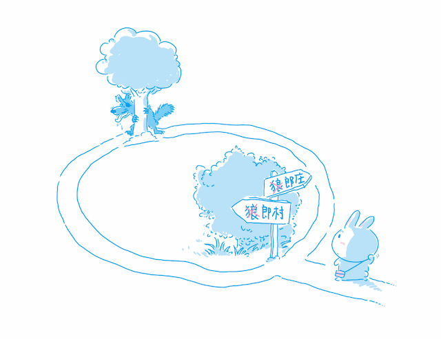

# 自由意志
 
 >**我们真的有选择吗？** 
 
 这其实是个很大的问题。因为，这涉及一个对每个人来说都无比重要的概念 —— 自由意志（Free Will）。上升到哲学高度，这依然是个终极问题：自由意志真的存在吗？
 
 不可否认，在整个人类历史 99% 以上的时间里，人们活在暗黑中，没有足够的能力去清楚地理解自己所处的世界。在那种情况下，人们好像只能认命，只能信命；人们也想作些判断，但最终无能为力，感觉是徒劳。 
 
 是什么正在改变我们和这个世界的关系呢**科学的进步。** 
 
 爱因斯坦当年总是笑嘻嘻地说：“上帝才不会跟这个世界扔骰子玩呢……[^1]”那是因为爱因斯坦就是接受不了海森堡（Werner Heisenberg）提出的量子力学中的一个基本原理 —— 不确定性原理[2]。
 
 量子力学后来的发展证明，这一次是爱因斯坦错了。有一篇文章和一本书可以推荐好奇的读者看看
 
 > - [You Are Wrong, Mr Einstein!](http://www.amazon.com/You-Are-Wrong-Einstein-Heisenberg/dp/981432499X) by Harald Frizsch 
 > - [Does God play Dice?](http://www.hawking.org.uk/does-god-play-dice.html) by Stephen Hawking 
 
 
 
 这真是个伟大的解脱。
 
 “未来是不可知的（unknown）”和“未来是不确定的（uncertain/random）”之间有着看起来细微但实际上意义重大的差异。
 
 > - 未来是不可知的（The Future is unkownable），意味着我们对未来毫无办法，正如我们对过去无可奈何一样。[^2]
 > - 未来是不确定的（The Future is uncertain/random），意味着我们对未来有一定的概率可以成功预测。
 
 换句话讲，当我们抛出一个硬币，在它落稳之前，我们确实不知道它究竟是哪一面朝上，但我们确实知道任何一面朝上的概率都是 1/2 ——**这是巨大的差异。** 
 
 人们常常错误地把自由意志之争的根源归咎于宗教信仰。在我看来，这有很强的误导性，也很不利于社会和谐，更不利于自己的身心健康。人们常常被教科书弄得误以为科学和宗教是水火不相容的，可实际上，数数历史上有多少重大的科学贡献是由神职人员作出的，我们也许会得到一个不太一样的结论。
 
 发现遗传原理的孟德尔（Gregor Johann Mendel）就是神职人员。可为什么孟德尔的科学结论没有受到普遍的猛烈抨击呢？在同一时期，为什么比他也就大个十几岁的达尔文（Charles Robert Darwin）得出的科学结论却始终遭到顽强的抵制呢？因为某些科学结论会严重影响抗拒者的世界观、价值观。所以，从本质上来看：
 
 > 科学的敌人并不一定是宗教，科学的敌人一定是那些不愿意改变自己既定人生观、价值观的人。
 
 声明**我个人至今无宗教信仰。** 
 
 我们今天对概率的知识，源自这样一个聪明人闲着没事琢磨的问题，这个问题后来被称**“The Problem of the Points”** 。
 
 A 和 B 两个人拿总金额相同的筹码开始玩一种公平的、1/2 概率的赌博游戏。今天我们可以抛硬币，那个年代的游戏名字叫“Balla Game”。两个人约定当其中某个人赢到第 6 次的时候，整个游戏结束。可是，在 A 赢了 5 次、B 赢了 3 次的时候游戏不得不结束。问题来了：按照之前的约定，两个人应该如何分手中的筹码才是公平合理的？
 
 琢磨这件事的人有多聪明呢？他叫帕西奥利，是达·芬奇的数学老师。他发明了复试记账法，翻译了《几何原本》，还有一本奇书 —— 《数字的力量》（De Viribus Quantitatis）的英译版，直到2007年才出现。
 
 100多年以后，有两个人合力找到了答案。帕斯卡和费马 —— 就是那个提出费马大定理的费马 —— 又是一个随便提个问题，其他人要努力 350 多年才能解决的家伙。
 
 不过，最终帕斯卡的解决方案是优于费马的。帕斯卡最后给出了一个公式，计算如何分配才真正公平合理。
 
 
 
 其中**r** 和 **s**  分别代表两个人当前总计赢过的次数。
 
 看不懂公式真的无所谓，但要理解其意义。这是人类第一次拥有且正确使用**期待值** （Expectation Values）这个概念。这是概率论的起点，而概率论就是风险控制的基础工具。
 
 在我看来，450 年前的一次计算，已然结束了关于自由意志的争论，我们可以对未来有所期待，通过概率论（数学）这个工具，甚至可以计算出期待值究竟是多少 —— 这还不够吗？显然不够，400 多年后被量子力学再一次证明，也依然不够。为什么呢？为什么呢! 为什么呢？!
 
 >**因为绝大多数人真的不认为科学与自己的生活有太大的关系。** 
 
 还好，起码对一些人来说，科学结论很重要。想想吧：如果未来不是“不可知”的，如果未来虽然是“不确定的”但多少是可计算的，那这事实对我们中的一些人意味着什么？答案是: 
 
 >**希望。** 
 
 “Grit”的意思是“坚毅”[^3]。什么令人坚毅？很多人都会说是“信念”。我个人不喜欢这个含混的说法。我觉得用另外一个词更好、更准、更有指导意义:
 
 >**学识使人坚毅。** 
 
 大学里认真学过统计概率的人是不大可能去买彩票的 —— 从心理上就说不过去，因为这是对他们智商的侮辱。金融专业毕业的人通常会想办法全款买房买车，这不仅仅是因为他们可能赚的比较多，更因为他们对利率和理财的理解使他们无法作出分期消费的决定。可与此同时，不买彩票的人在其他方面一定聪明、一定坚毅吗？绝不分期买房、分期买车的人在其他方面一定如此聪明、如此坚毅吗？答案明显是 —— 不。为什么呢？因为每个人在各方面的学识不同，于是，在各方面的坚毅程度也不同。
 
 在今天这个时代**求知就是求富。** 因为知识变现不仅越来越容易，也越来越快，越来越多。
 
 帕斯卡在 1642 年的时候设计了一个计算器 —— 对，你没看错，就是计算器，只不过是机械的。没有这种计算器，他也不可能有那么多成就，因为他的工作需要太多重复的、枯燥的计算了。可即便聪明如帕斯卡，在他的那个年代努力了终生，也没能成功地把这个精巧的发明商业化，原因可能是成本过高、无法实现量产等。当然，帕斯卡这个设计里的重要思想影响了后来的很多人：
 
 >**重复的、枯燥的工作应该自动化完成。** 
 
 400 年不到的时间里，这世界发生了很多变化。其中之一就是，越来越多的人靠着一点点的小发明的商业化赚到了越来越多的钱。这就是时代的不同。所谓“屌丝逆袭”的故事只有到了现代才开始批量出现，就是因为智力变现、知识变现可能了、容易了。但大量的明证并没有降低人们的普遍认知，所以民间流传甚广的智慧大都是反智的，人们津津乐道的是彰显这样道理的故事 —— 聪明反被聪明误。
 
 再讲讲另外两个人的故事。
 
 一个人叫卡达诺。今天的智能设备里都有陀螺仪，陀螺仪里有个重要的组件叫万向接头，这个组件应用极其广泛，我们看到的每辆汽车里都必须有这东西。卡达诺是世界上第一个提出这种接头设想的人，那是在 1545 年。他也是第一个用大小不同的齿轮计算比例问题的人。没有这位先行者，帕斯卡不可能设计出计算器。
 
 和历史上的很多著名科学家一样，卡达诺痴迷于赌博游戏。天天玩，天天赌，也妨碍不了他出版了 131 本书（不算另外 170 多本被他自己烧掉的），死后还留下了 111 个抄本。我们今天看到的高产作家，比如斯蒂芬·金，比起卡达诺来说真是“弱爆了” —— 由此看来，我平日里写点小文章自娱，真是压根就不值一提。
 
 卡达诺是第一个注意到 2 个骰子点数之和的概率分布的人。出现“7”的概率是 1/6，出现“2”或者“12”的概率不是 1/12，而是 1/36。卡达诺天天赌，但到最终没赢多少，也没输多少。对他来说，赌博游戏是天然的实验室，他贪玩是一方面，但更多的是满足了他的好奇心。
 
 另一个人叫达米尔，也是个大赌徒，很聪明，但是达不到数学家的高度。他很喜欢卡达诺的书，尤其对2个骰子的概率分布感兴趣。达米尔是那种常见的读不懂原理但敢于应用结论的家伙 —— 这也是一种聪明，起码是中等聪明。很多人之所以渐渐笨起来，是因为读不懂原理的话他们是断然不敢应用结论的。
 
 达米尔还有一个重要的本领 —— 组织沙龙。他相信开放的讨论是解决问题的唯一方法，他还坚信诚信是提高讨论效率的最根本手段之一。在一次沙龙中，是他扯出 100 多年前的那个谜题 —— The Problem of the Points，帕斯卡和费马接受了挑战，最终在他们的通信往来中奠定了现代概率论的基础。
 
 达米尔相当聪明，他直觉上判定，连续扔 4 次骰子至少出现 1 次“6”的概率可能略微高于 50%。他用这个方法赢了不少钱。“草根”出身的他也因此有底气给自己冠了个名头 —— Chevalier（骑士）。后来，他得意忘形，又开始直觉上判定连续扔 24 次骰子至少出现 1 次“12”（即，“双6”）的概率也可能略高于 50%，结果输惨了。要不是后来遇到了帕斯卡，他可能都不知道自己怎么输的。
 
 帕斯卡帮他算了一下，连续扔 4 次骰子至少出现 1 次“6”的概率是
 
 
 
 确实高于 50%。但是，连续扔 24 次骰子至少出现 1 次“12”的概率是
 
 
 
 不输才怪呢！于心不忍，帕斯卡又帮达米尔多算了一个 —— 要想赢，得至少连续扔 25 次骰子，而不是 24 次！
 
 
 
 可达米尔没办法用这个结果赢到钱了，因为结果是在沙龙里讨论出来的，也就是说 —— 大家都知道了。
 
 在这个故事中，我们看不到半点“聪明反被聪明误”**不够聪明才真的误人，不是吗？** 
 
 一个更重要的事实需要重新审视：没错，我们是出身平凡，但我们真的需要，抑或真的必须打败谁才行吗**在今天这个时代，我们可能并不需要打败谁才能过得更好，起码可以过得足够好。** 细想想，很多人其实是被自己打败的。他们普遍的特点是一样的：在虽然很难但明明可以选择的情况下，误以为自己完全没有选择，于是只能走进死胡同。放弃了选择，就是被打败了。
 
 在一个普遍认为人们其实没有选择的世界里：
 
 >**用以学识支持的坚毅认定其实选择是存在的，并且是可追求的，是有很大相对优势的** 
 
 —— 就是这样。
 
 知道收入分为两种，主动收入和被动收入，而后更重视被动收入，这也是选择，还是一个很重要的选择，更是一个改变未来的选择，不是吗？
 
 

 
 [^1]: God doesn't play dice with the world.
 [^2]: Uncertainty Principle，“测不准原理”多少是误译，或者干脆是“望文生义”。至于“测不准”这个翻译如何来的，我也搞不清楚。心理学上有个概念叫“观察者效应”（Observer Effect），翻译成“测不准”还多少有道理一点。
 [^3]: TED 上有个很好的视频，值得一看: [The key to success? Grit](https://www.ted.com/talks/angela_lee_duckworth_the_key_to_success_grit?language=en)
 