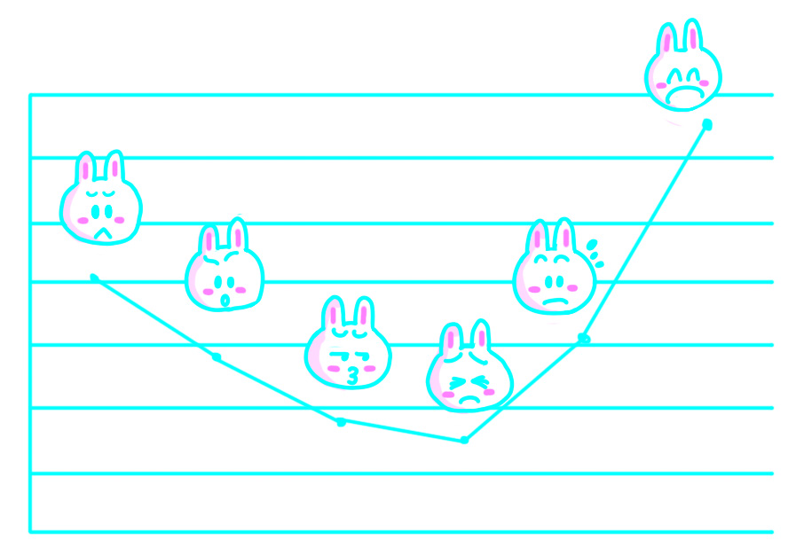
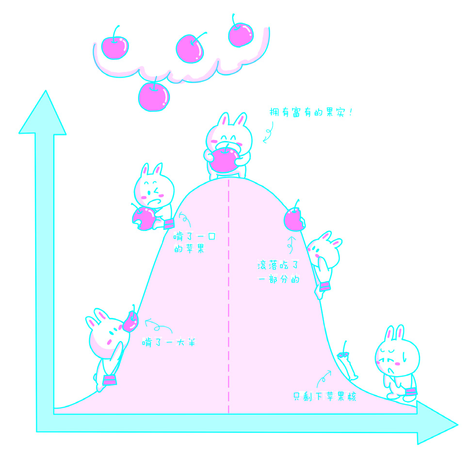

# 第二章：现实

## 1. 速成绝无可能

不管在哪个领域，学习也好，工作也罢，长辈们的建议总是“**戒骄戒躁**”。虽然把“戒骄”放在前面，但“戒骄”其实是有了一定成绩之后的事情。对大多数人来说，首先要“戒 躁”，才有机会“戒骄”。

“戒躁”说了千百年，可我们还是很浮躁。我们总在不由自主地想，如果有速成的办法就好了——可惜，没有，确实没有。几乎人人都想速成，连上帝都不例外。《圣经》里说上帝仅用6天时间就创造了这个世界，而后就迫不及待地休息去了。事实上，应该是人类创造了上帝才对，这样才能解释为什么这个上帝拥有人的基本特征——浮躁，做什么事都想速成。

期望速成，从微观层面上看，有两个主要原因。

第一个原因是人希望自己的欲望马上得到满足的天性。一个确定的事实是，几乎每个人都有无穷无尽的欲望。虽然每个人都知道，不是所有欲望都能被满足，但人们仍然不会放弃追逐尽可能多的欲望。于是，不劳而获成了每个人心中的诸多愿望之一，甚至可能是其中最大的愿望。如果达不到不劳而获，少劳多获也可以接受，而且最好是“劳”尽量少，“获”尽量多，多多益善。从这个角度更进一步地说，大多数人都抱着类似这样的想法：如果收获的可能性很大，最好马上看到成果；如果收获的可能性很小，最好马上知道结果。

每个人都有这种欲望，差别仅在程度或者表现上。

这种差别也可以解释为什么一些人比另外一些人更容易迷恋赌博——因为这些人比另外那些人更想要甚至需要马上知道结果。

在各种赌博形式中，老虎机可说是赌鬼们的最爱了。这说的仅仅是赌鬼，赌王是不玩老虎机的，因为他们在这种纯粹的赌博中得不到乐趣，也不能保证收益。而赌鬼们不同，尽管和赌王一样有着强烈的赢利欲望，但是，赌鬼们潜意识里还有另外一个更需要满足的欲望——马上看到结果。老虎机可以满足这个欲望，而且操作极为简单——拉一下手柄，5秒之内就能得到结果。是输是赢其实并不重要，重要的是“5秒之内就能得到结果”！

同样，酗酒疯狂无度的、嫖娼乐此不疲的、吸毒罔顾死活的，都是这种“希望自己的欲望马上得到满足的天性”使然。更要命的是，几乎整个社会都在用各种各样的方式刺激人们发挥这种天性，并愈演愈烈。电视上的减肥广告告诉你，减肥药都功能神奇，当天见效。报纸上的医疗广告告诉你，无论得了什么病都不要怕，找他一准手到病除。公交上的培训广告告诉你，不管学什么都要速成，因为人生苦短。有一个防身术学习班期期火爆，看看它的名字就能明白原因——一招制敌！

最善于利用人类这一天性的商业机构也许就是银行了。想住大房子？好！我给你办贷款，慢慢还，不着急，30年之内还清就好。想买新轿车？行！我给你办贷款，慢慢还，不着急，5年之内还清就行。房子有了，车子有了，还想要什么？说出来，没关系。没有钱可以办信用卡，先透支嘛，给你10万信用额度，想买什么就买什么吧！这是一个“享受在先”的时代，并且人人如此。至于银行最终如何对付那些欠债不还的人，可从来不会在广告上提及，也尽量不对外公开。

第二个原因，也是浮躁的根源，就是很多人不懂“有些阶段就是无法跨越”这个道理。因此，他们才那么不现实地希望找到一个方法，靠其迅速达成目标，完结任务，获得解脱。可是，无论做什么事都需要时间，而且可能需要很多时间。举例来说，谁都没有办法今天怀孕、明天生产。从卵子受精到胎儿出生，大约需要40周，这个阶段无从跨越。聪明也好，力大也罢，一位母亲从怀上孩子到生出孩子，就是需要这么长时间。

除了上面这两个微观上的原因外，还有一个宏观上的原因也使人们常常不由自主地奢望速成——哪怕之前已经“醒悟”过。这个宏观上的原因即所谓的“现状使然”。根据达特茅斯学院经济学教授[布兰奇弗劳尔](http://goo.gl/vLrz8)的调查结论，通常情况下，一个人一生各个阶段的满意程度和其年龄分布可以连成一个U型曲线。



从这张图中可以看出，大多数人对其自身的满意程度从15岁左右开始持续下降，这大抵是不再无知无畏造成的。从那时起，一个人慢慢意识到自己在这个世界上其实微不足道，进而开始在所谓的理想和扭曲的现实中拼斗、挣扎，直到45岁左右才渐出苦海，曲线开始上扬。这就是以一个普通人的心智，观察、感受、思索、理解、实践、回顾，直至恍然大悟或者误入歧途的时间——30年。

在这漫长的 30 年里，由自我满意度持续下降所造成的浮躁形成了巨大的心理压力。越是浮躁，就越是对自己的现状不满；越是对自己的现状不满，就越是浮躁。

更大的问题在于，大多数人并不知道几乎所有的人都是这样。相反，现实好像总是提醒我们：有些人过得比我们好多了。这就是统计学的优势。它可以排除感情因素，用冷冰冰的数字展示现实。如果它所展示的现实与我们原本以为的并不相同甚至相反，这一优势就变得更为明显。掌握统计学常识的人，心智力量显然要比那些对此毫无了解的人强大——他们可以理解统计学结论的意义，即便那结论并非来自亲身经历，而他们也因此离现实更近一些。

总的来说，**一方面是自己的无限欲望，一方面是要完成的事情太多，一方面是自我满意度的不断下降——这就是人们总是不由自主地期望速成的根源**。出路肯定存在，但这出路只有一个起点——接受现实。**告诉自己：我有不足，我需要时间，我没办法一蹴而就。**

## 2. 交换才是硬道理

速成不可能，那该怎么办？答案只有一个字：**换**。俗话说“一分耕耘，一分收获”，从本质上看也是这一个字，**换**。

不成熟的人有什么样的特征？他们的特征很多，但一个通病就是整天都在想“我要……”，全然不顾自己其实一无所有。每个人的起点不同，有些人的地板是另一些人的天花板。但起点就是起点，尽管不同，可每个人都要从起点出发。从某种角度看，在起点上就是在起点上，都相当于从零开始。最初每个人都一无所有，而后通过各种手段，或努力、或投机、或勤奋、或取巧，换取能够拥有的东西——无论手段如何。当然，很多人连投机取巧都不会，更谈不上努力和勤奋，致使长期以来得到的东西少之又少，积累聊胜于无。

然而“我要”的欲望从来不会消减，只会不断增加。大多数人之所以会浮躁，是因为他们一无积累（或者积累太少，几乎无法换取任何东西），二无方法和经验（所以求而不得）。与此同时，“我要”的欲望恰恰因为无法获得而熊熊燃烧。情况更恶劣的时候，那欲望之火甚至可以烧掉他们所有的时间和精力，以至占用原本可以用于努力（或者投机）的时间，陷入死循环，无法挣脱。

积累多的人之所以稳健，是因为对他来说，“我要”的欲望可以用“我有”的东西来满足。即便“我有”的暂时不够，他也能借助已经拥有的足够的努力和勤奋（抑或投机取巧的方法和经验），只需假以时日，定能如愿以偿。一旦得偿所愿，不仅“我有”的更多，“我要”的也更容易获得，如此形成良性循环。

> 生活中类似的死循环非常多。比如，找工作的时候，招聘方要求应聘者有三年以上工作经验，应聘者因为没有工作经验而无法获得这份工作，进而他就没有工作经验……好像永远无法找到工作；再比如，你到银行贷款，银行说贷款你得有抵押，有东西可供抵押的意思是，你是有资产的人，而你很可能恰恰因为没有资产才急需贷款……好像永远无法获得贷款……

生活的本质就是这样，你想要什么，它偏不给你什么。摆脱这个死循环的方法只有一个——给我什么我就用好什么，积累到一定程度再去换能换的东西。要不断想办法运用心智的力量去识别那些死循环和恶性循环，然后在好像不可能的情况下跳出去。出者存，困者亡。

要想跳出去倒也简单。拿出一张纸，将其划分为左右两半，然后做两个列表，左边是“我有的”，右边是“我要的”，逐一罗列。完成后要尽量客观地判断：先划掉“我要的”当中那些无法用“我有的”换取的；再仔细判断在剩下的能用“我有的”换取的那些“我要的”之中，哪些是必须的、必要的、重要的、不可或缺的，并在其上做重点标记。偶尔会有一些“我要的”无法用现在“我有的”换来，却又是必须、必要，甚至不可或缺的，这需要我们认真考虑用什么样的手段再积累一些“我有的”，从而有足够资本换取那些“暂且换不到但极其想要的”——或努力勤奋，或投机取巧。投机的方式并非不能用，尽管它的成功概率实际上并没有看起来那么高，而它的失败概率甚至和它看起来的成功概率一样高。

还有一个辅助手段，就是在想到“我要什么”的时候马上提醒自己，接下来要花一些时间去思考“我有什么”。后者会在转瞬间让你“脚踏实地”。

最坏的情况是，拿出纸和笔认真面对自己，结果发现“自己什么都没有”。这也许令人气馁，但其实对任何一个正常人来说，“还有时间”、“还有精力”、“还有正常的智商”就已经足够了。只要努力，只要勤奋，机会总是存在的——我们必须要相信这一点，最好相信到毫不怀疑。

## 3. 完美永不存在

人人都希翼完美，只可惜，完美并不存在。[大不列颠语料库](http://goo.gl/uyr9E)的统计数据表明，最常与“完美主义者”（perfectionist） 这个词一并出现的是“脆弱的”（vulnerable）。这不是偶然，这是人们在记录现实时自然使用的搭配。为什么完美主义者总是脆弱？因为他们总会被现实打击，而且不明就里，常常怨天尤人：“为什么受伤的总是我？”

越是能力差的人，越有那种非常不现实又极其脆弱的完美主义倾向。他们不现实，是因为他们不懂。

做咨询工作的人都有深刻的体验：客户的常识越少，要求越高——因为不懂，所以会随便提要求。同样，常把事情搞砸的人，对所谓的“做好”全凭想象，没有任何事实依据——因为从未“做好”过。于是，各式各样的症状都出现了：好高骛远、异想天开、白日做梦、纸上谈兵……因为他们不懂，所以他们不现实；因为他们不现实，所以他们脆弱。他们很容易受伤，因为他们的要求太高，也因此总是做不到。

有时，有些人会故意这样做，尽管他们自己不愿意承认。把自己标榜成完美主义者，是他们抬高自己的手段，是他们不去做一些事情的借口。他们把这个借口说出来的时候真个掷地有声：“做不好的事情我不做！”然而，这可能是装出来的。人就是这样，装得久了，就装得像了；装得太像、太久，不管事实怎样，自己倒是先信了。而这当然会影响之后的决定和行为。

> 注意，很多实干家也是这么说并且这么做的。正如之前提到过的一样，“做出截然相反决定的理由竟然是一模一样的。”

这些人所说的“做不好”，其实是“不能一下子做好”，但问题在于，没有什么事情是一下子就能做好的。所以，他们这个也不做，那个也不做，到最后，已经不是“不做一些事情”了，而是“什么都没做”、“什么都不做”，结果“一事无成”。好笑的是，即便到了这样的境地，还有不少人打肿脸充胖子，声称“我没什么可后悔的”。

一些真正优秀的人，也会被别人称作“完美主义者”。事实上，这种描述并不准确。比较准确的说法应该是“他们是有能力做到更接近完美的人，并且，他们一直在努力”。

例如，好莱坞导演[詹姆斯·卡梅隆](http://goo.gl/3RU2C。)就总被称作“一个完美主义者”。他不断追求完美是事实，但前提是他不仅有能力，而且坚持不懈。为了拍出《[阿凡达](http://goo.gl/KAdU)》，他在拍完《[泰坦尼克号](http://goo.gl/EXpHX)》之后准备了10多年，其间经历非常坎坷。《[终结者](http://goo.gl/HmoUW)》系列的巨大成功使他成为好莱坞的当红导演，但当他执导《泰坦尼克号》的时候，严重超支的费用磨光了投资方的耐心，以致他只能采取放弃片酬、只拿版税的方式完成拍摄。《泰坦尼克号》的成功，使他拥有了拍摄《阿凡达》的资本。但是，他并没有仓促上马，而是做足了准备：为了创造完美的3D效果，他耗资1400万美元与日本索尼公司的研发总部合作开发出了他理想中的拍摄设备；为了能完整地把握3D电影，他参与了另外一部3D电影《[地心历险记](http://goo.gl/kc3b1)》的制作……这一切，最终成就了一部震撼人心的《阿凡达》。

好莱坞的另外一位导演[克里斯托弗·诺兰](http://goo.gl/de4WN)也总被称为“完 美主义者”。为了追求《[盗梦空间](http://goo.gl/eC431)》的完美效果，他准备了10年。为了使自己真正拥有驾驭宏大场面的能力，他在《盗梦空间》之前连续接拍了《[蝙蝠侠](http://goo.gl/zHHdc)》系列的《[开战时刻](http://goo.gl/XHHqP)》和《[黑暗骑士](http://goo.gl/MuTn0)》。然而，即便是诺兰这样的大导演，也无法保证自己的影片没有遗憾。

没有人能够做到完美。我们至多能做到接近完美，或者更接近完美。所以，我们不管做什么事情，都需要时刻忍耐各种各样的不完美，否则事情根本无法完成。最终完成的事情，结果也常常是不完美的。缺憾必然存在。再往大一点说，生活本身就不完美。谁的生活不是磕磕绊绊？谁在死去的时候没有一丝遗憾？现实如此，只能接受。


## 4. 未知永远存在

我们害怕未知，害怕不确定的东西。我们希望一切都在自己的掌握之中，只是我们永远做不到。

一起回想一下。上学的时候，每个班里都有爱钻牛角尖的人。他们认为，在任何时候、对任何事情都应该“刨根问底”，要把一切都搞清楚才能罢休——并将这种态度当作不可放弃的真理一般对待。正因如此，他们全然无法忍受任何“未知”的存在，所以要“冥思苦想”、“问个不休”，用尽全部精力，以至没有意识到另外一个显而易见的事实：他们和其他人一样，从来没有在任何一个问题上全知全晓。

大部分人都多少有钻牛角尖的习惯，只是程度不同——因为对未知的恐惧早已根植在人类的基因中。人们害怕未知，一切未知的、不可知的因素都会严重威胁人们的安全感。

未知因素给人们带来的心理压力远远超出一般人的想象。假设有一个未知因素X存在，它可能导致A、B两种情况，这时“可能这样、可能那样”的犹豫或许已经造成了巨大的心理压力。如若有第二个未知因素Y，它也可能导致两种情况，即C或者D。那么，X和Y共同作用的结果可能有AC、AD、BC、BD这4种情况。如果再有第三个未知因素Z，又可能导致E、F两种情况，这时就有8种（2<sup>3</sup>）结果……也就是说，随着未知因素数量的增加，这些因素所引发的结果将以几何级数的方式飞速增加——这就是未知如此可怕的根源。

在进入任何一个新领域时，这种压力都能使新手窒息。而已经在那个领域里“浸泡”过一段时间的人，往往早已忘记了曾经面对的恐惧和压力，懒得（抑或不屑）开导新手、帮助新手。其实，更多的时候，一些老手实际上并不是“懒得”或者“不屑”，而是“没想到竟然连这个也需要解释”。这就像我们每个人小时候要挣扎很久才学会系鞋带，可成年之后却早已忘记它竟然是一件需要挣扎才能学会的事情一样。而另外一些老手是因为“很快就学会”所以没想到“竟然还有人连这个都不会”。

例如，自学编程的人可能会在教程编纂者全然没想到的 地方卡壳。当Google API 的文档编纂者穷尽力气去写一个“想让任何人都看得懂”的文档的时候，他们不知道有些新手一看到以下的代码，就会先被“foo”、“bar”这两个词卡住。这些新手会不由自主地问：它们是什么意思？为什么要取这样的名字？

```javascript
foo('bar', {
  ...
}
, 200, null)
```

> (英文)程序代码中的“foo”、“bar”类似于中文里的“张三”、“李四”，都是无特别含义的名字。参见[维基百科](http://goo.gl/jaq70)。

事实上，许多“入门读物”之中充斥这两个“怪词”，却又几乎从来没有人针对这样的疑问提供充分的解释。

再如，很多人都不明白为什么循环代码块里的起始变量名称是“i”。事实上，谁都不是很确定。据猜测，“i”可能是“index”这个单词的首字母。在循环嵌套的时候，第二层循环的起始变量名称通常是“j”，但这不是某个单词的首字母了，只是因为“j”在英文字母表中排在“i”之后。在其他领域也是如此——学英语的时候，很多初学者都有过如是疑惑：“为什么‘John’这个名字会被翻译成‘约翰’？就算是音译，也差得太远了吧？”

> 可以到Google上搜索一下“[为什么 John 约翰](http://goo.gl/D1Z3O)”， 就知道究竟有多少人曾为此疑惑过了。

这些只是几个常见的例子而已。自学过任何一项技能的人，都能理解这种“牛角尖陷阱”几乎无处不在。

然而，为了进步，**我们必须忍受一定的未知。**

首先，我们要承认自己不可能全知全晓。有些时候，有些问题没有答案，就好像“先有鸡还是先有蛋”一样。而有些时候，即便有了答案，其原因也不见得是我们能够搞懂的。例如，学编程学到流程控制的时候，会知道这样一个知识：除了“顺序”外，只用“分支”和“循环”就能够完成任何流程——初学者大都会好奇，这是如何证明的呢？这个结论当然是经过严谨的证明才被广泛接受的，但究竟有多少初学者可以看懂证明过程呢？在这种时候，不是“反对问为什么”，而是“暂时不去问为什么”可能更划算。

> 参考Böhm和Jacopini于1966年发表的相关论文：[Flow Diagrams, Languages With Only Two Formation Rules](http://goo.gl/LR7d2)。

其次，我们要了解未知分为两种：一种是永远不能解决的，另一种是在可预见的未来也许能够解决的。对一个人来说，超过100年就可以算“永远”了，所以，第一种未知对个人来说意义不大；第二种未知却是我们必须面对的，学习的难度也在于此。“第一章的内容需要在掌握后面某一章的知识之后才能深入了解”，这几乎是所有高难知识体系的普遍特征。也就是说，在第一章，我们会有无数疑问，可这些疑问以当时的知识是无法全部解决的，需要我们继续学习，用接下来获得的知识解释今天的疑问。这就是那些爱钻牛角尖的人最终常常吃亏的重要原因——他们总是想“马上解决当时不可能解决的问题”。

事实上，“做人难”也是一样的道理。我们从小时候开始就要做一些事情，而为什么要做，只有长大之后才会明白。记得在小学三年级的时候，父亲“威逼利诱”让我做了件事——手抄《新华字典》。刚开始抵触，后来习惯，再后来因为认识很多别人不认识的字而洋洋自得。甚至后来在课堂上讲“词频”这个概念时，我还常用“鬯”这个字举例，而它就是那时候我学会的“怪”字之一。抄字典这项任务我断断续续花了差不多一年半的时间才完成。现在想来，当年“学”过的那些怪字异词大部分早就还给《新华字典》了，而期间所获得的好处却享用至今，那就是不怕枯燥。那么枯燥的事情都做过了，还有什么枯燥承受不了？

> 鬯：chàng <br />
①始见之于商代的一种香酒。是用鬯（一种香草）与秬（黑黍）酿制而成的高级酒。用于祭祀、宴饮。<br />
②同“畅”。

再强调一次，我们必须接受这个现实——未知永远存在。而后，我们只能不断地尝试着去适应“在未知中不断前行”。

如果不能接受这个现实，就无法忍受未知的存在，也会平添无数的焦虑。焦虑是导致时间浪费、效率低下的根源之一。当人处于焦虑的时候，甚至可能出现一切理智都被清空的情况。另外，焦虑的情绪会让人觉得“必须要做点什么”，但是，在缺乏理智的状态下做出的任何决定和行为都可能带来灾难性的后果。一个相对有效的策略是：当有问题解决不了时，可以先把它记下来，然后继续前行。注意，一定要把它们记下来。

很多人没有记录的习惯，以至出现曾经因为思考（疑问就是思考的起点）后“忘了”而失去获得答案机会的情况。继续前行，并不意味着忽略这些问题，因为它们已被记下来了。而又因为它们被记了下来，所以可以在以后拿出来重新审视，不一定当什么时候、在什么地方、因为什么由头，它们之中的一部分就突然有了清楚的解决方案。当然，可能性最大的原因只有一个——你一直在前行，你一直在积累，你一直在成长。所以，到有了答案的那一刻，你不再是当初无能为力的你，你已经重生。


## 5. 现状无法马上摆脱

人们往往会低估环境的巨大能量。在我们的文化环境里，从小教育孩子的“外因通过内因起作用”完全是“顾头不顾腚”的“屁话”一句。其原因可能是人们往往会忽视环境，而把来自环境的影响当作“由衷”的想法。例如，现在有很多学生说自己对“商科”感兴趣——相信我，他们真的“由衷”地如此认为。可这确实完全出于他们自己的想法吗？很可能不是。在我们的生活中，随手打开一份报纸，头版里出现的人物大都是政要，这些孩子仅凭直觉就知道自己的前途跟这些完全扯不上关系；再看第二版，出现的人物大都是“娱乐明星”，这些孩子同样仅凭直觉就知道自己的前途跟这些基本扯不上关系；再往后看，大都是“商界名流”——这些孩子终于看到一些对自己来说也许可行的前途……于是，一个想法冒了出来：“我要从商……”

与外界的无谓比较，让每个人凭空多出了一个根本不属于自己的目标，动辄被自己的理想绑架。很多人（应该是绝大多数人）的工作态度本质上是“骑驴找马”。基于种种原因（主要是概率问题），人们往往对自己正在从事的职业并不满意。很多人都心怀梦想，有一个“无论如何早晚都要从事的梦想职业”，而不幸的是，很多人正因如此最终沦为平庸之辈（有例外，但这例外太少，几乎可以忽略）。

尽管天分确实很重要，但一个人的能力主要靠积累获得。从一个人开始从事一个职业的那一瞬间起，只要足够认真、努力，他的能力就会不停地积累。如果这个人实际上向往的是另一个职业，那么他的所谓“梦想”几乎必然使他在当前这份职业上心不在焉、无甚积累。其实，世界上80%以上的职业并不过分依赖天分，更可能甚至几乎只依赖积累。天长日久，这个人在当前的职业中将逐渐落后于那些认真做事的人。但此时他不会因为自己的落后而奋起直追，反过来，更可能的是把“反正我的梦想不是这个”当作借口。

无论是谁，进入自己梦想职业的成本都很高昂——极少数运气好的人除外——有些相对依赖天分和运气的行业更是如此（顾长卫导演、蒋雯丽主演的电影《[立春](http://goo.gl/4qJyy)》讲的就是这样一个故事）。当初未能从事一个职业就已经能说明问题了——除了运气不好，更可能的是因为积累不够。几年过去，这个人在他的所谓“梦想职业”中的经验积累依然是零，仍旧只是空有梦想。还有一个他更可能宁愿视而不见的事实是，那些在他所谓“梦想职业”中拼搏努力的人在这段时间里已经积累了无数经验，磨炼出了他在“圈外”无法想象的各种能力。就算有一天，这个人有足够运气，进入了那个他梦寐以求的领域，结果可能还是发现自己一无所有、毫无竞争力，最后不过是一切清零、从头再来。

心怀“梦想”的时间越长，它的沉没成本就越高。很多人都在无意之间被自己的“梦想”所绑架，所以，很多时候，对很多人来说，所谓“梦想”也许只是陷阱。许多年来，我曾见过身边不少的人一点一点被他们珍爱的“梦想”毁掉。

越是不满现状，摆脱现状的欲望就越强烈，而这种欲望会让一个人最终迷失方向，因为无论是谁，从本质上看都无法摆脱现状——每一时刻的现状都是过去某一或者某些时刻的结果，而每一时刻的现状都是未来某一或者某些时刻的原因。没有人能够逃脱现实的束缚。

从某种意义上理解，“逆境造就成功、磨难令人成熟”之类的话纯属胡说八道。显然，在顺境中更容易成功，而且很多磨难根本没有必要——这更可能是失败者对他们自己一生都未曾有机会体验的成功以及成功者“意淫”式的猜想而已。失败者永远没有机会了解成功的真相，因为人最容易受自身经验的限制，而不曾有哪怕一点点成功经验的人更无从摆脱自身的局限。

对现状不满、急于摆脱现状，是人们常常不知不觉落入的陷阱（尽管偶尔这也是少数人真正的动力）。接受现状才是最优策略——有什么做什么，有什么用什么；做什么都做好，用什么都用好。不要常常觉得苦（这会让人忍不住顾影自怜，浪费精力与时间），而要想办法在任何情况下找到情趣——快乐是一种本事。这些年我遇到的几乎所有优秀的年轻人都有这样的特征：他们很少对现状不满（可能是他们的优秀使他们难以觉得不满吧），他们热爱自己的生活，他们相对更不在意外界的影响，他们更专注于做事而心无旁骛，他们身处良性循环之中，当然，他们也因此每时每刻都在进步。

## 6. 与时间做朋友


与时间做朋友的方法很简单：用正确的方法做正确的事情。

正确的方法究竟是什么稍后再说，这里先说说什么是正确的事情。最可怕的不是效率不高，而是干脆做错了事。如果做的事情是错误的，效率越高，结果越糟。如果做的事情是正确的，效率低一点也没关系，因为做一点是一点，多收获一点，多进步一点，动力就会更强一点，进而更容易持续地做下去。怎样判断所做的事情是否正确？核心的判断只有一个：看它是否现实。

几乎一切愚蠢的行为都来自否定现实、逃避现实。只有接受现实，才可能脚踏实地，避免心浮气躁、好高骛远。如果我们把成功朴素地定义为“用正确的方法做正确的事情，并在最后期限之前漂亮地完成”的话，那么，大多数所谓的“时间管理技巧”实际上发挥不了多大的作用，只不过是花拳绣腿。真正有用的往往是简单而又朴素的道理，例如“现实只能接受”。

接受现实不容易。有一个夸张的例子可供参考。

这个世界上的资源并非平均分布在每一个人的身上，能够比较好地表示这种分布情况的数学曲线是[正态分布曲线](http://goo.gl/SO0R8)。

> 数学一直是心智相对发达的人类所特有的、并且不断进步发展的、描述这个世界最为精确的工具——几乎不应该在后面加上“之一”。

正态分布是概率论中最重要的分布。大量的实践结果与理论分析表明，大多数随机变量均服从或近似服从正态分布，如测量的误差、学生的成绩、人类的身高和体重、产品的质量数据、投资的收益率等。

可以用一个相对简单的例子解释一下正态分布：建立一个平面直角坐标系，把世界上所有的人都放在这个坐标系里，其横轴（x轴）表示一个人所拥有的各种资源的总量，纵轴（y轴）表示与横轴对应的总人数（可以想象为占有资源量相当的人在x轴的一个点上“叠罗汉”），据此勾画出的曲线应该非常接近正态分布曲线。这就是我们所处的真实世界，只有极少数人在资源上极端贫困，也只有极少数人在资源上极端富有，绝大多数人属于中等水平。



这种资源分布上自然的“不均匀”，看上去简单易懂，但古今中外都有很多人拒绝理解和接受它。他们甚至拒绝使用“不均匀”这个词，而是用“不公平”取而代之。历史上有无数次战争、无数次掠夺，但从本质上看，不过是因为把“均匀”理解成“公平”造成的。把“不均匀”理解成“不公平”，就可以理直气壮地打着“公平正义”的旗号为所欲为。


资源原本是有限的，经济学里将这种现象描述为“资源稀缺”。在整体上资源稀缺的前提下，“资源并非均匀分布”体现在每个人身上，直接的结果就是“绝大多数人都觉得自己拥有的不够多”。在我们生存的这个世界里，资源稀缺是客观现实，也恰因如此，人们的主观愿望肯定不可能全部被满足。

理解这种现象貌似不难，但在清楚地理解后还能平静地接受就不那么容易了。无法接受这种现象的人到今天也还随处可见。对那些无法接受现实的人来说，其实只剩下一个选择——逃避。和[苏格拉底](http://goo.gl/edORr)生活在同一时代的[第欧根尼](http://goo.gl/fXPuw)，在意识到资源稀缺的时候选择了逃避，而他采取的逃避方式是限制自己的主观愿望。第欧根尼对这个世界说：“你不是资源稀缺吗？那我不消费了。我没有欲望总可以了吧？”所以，他主张清心寡欲，累了随便找个木桶住下，饿了到垃圾堆里找点剩饭。他也喜欢享受，但是他可以控制自己的欲望，进而只享受真正零成本的所谓“消费”——例如晒太阳。所以，他曾对[马其顿国王亚历山大大帝](http://goo.gl/kxXn7)非常不耐烦：“我希望你闪到一边去，不要遮住我的阳光。”尽管亚历山大大帝曾允诺，会满足他的一个愿望。

2000多年后，[卡尔·马克思](http://goo.gl/Zllzq)选择了另外一种形式的逃避，即使用幻想。他注意到了资源的“分配不公”（准确地讲应该是“分配不均”），但无法接受“资源分配与人性并无关系”这个事实。他认为，“资源的配置应该在最无愧于和最适合于人类本性的条件下进行”。在用劳动价值论和剩余价值论解释自己对世界的观察之后，他开始幻想，对这个世界说：“你不是资源稀缺吗？没关系。别看现在是这样的，但是，早晚有一天，物质会极端丰富。到那个时候，人们就可以各取所需了！”事实上，在马克思去世100多年之后的今天，物质和他做出以上论述时相比已经相对极端丰富，但我们看到的事实是：物质依然稀缺且依然分配不均，贫富差距也越来越大。

现代西方经济学缘起于[亚当·斯密](http://goo.gl/FM8d6)的学说，经过[大卫·李嘉图](http://goo.gl/cDvbd)的补充，直至[约翰·梅纳德·凯恩斯](http://goo.gl/m4Bov)，才算彻底正视了资源的稀缺性，认为经济学的根本目的在于研究“如何运用有限的资源发挥最大的效用”。换言之，要在承认资源稀缺的前提下研究如何提高“效用”。

平静并理性地接受“资源稀缺”这个现实，其困难程度超乎想象，以至从人类整体来看，理解并接受这个现实花费了将近2500年——从第欧根尼到凯恩斯。

尽管现实总是如此难于接受，坚强的你却应该坦然。以上提到的种种现实，包括“速成绝无可能”、“只有付出才有收获”、“完美永不存在”、“未知永远存在”、“现状无法马上摆脱”，都既清楚又简单，你必须要接受——不仅要接受，还要牢记；不仅要牢记，还要坚信，不容半点动摇。最好时常把自己的一些念头记下来，然后与这几条现实对照，看看它们是否与这些现实相符。之后，你会和所有人一样，发现自己常常在不知不觉之间被一些实际上完全不现实的念头所左右。这是正常的。但是，通过不时地记录、思考与反省，你会越来越善于甄别那些不现实的念头，进而摆脱他们的影响。这就是差别。很多人一生都不知道自己究竟有多么不现实。之前提到的“既勤奋又懒惰”的人群，基本上都是把这些现实当作老生常谈的道理——视而不见、听而不闻、从不记录、从不反省，才常常做出荒唐的决定，最终堕落到那分田地。

百分之百地接受现实也许痛苦，但要醒悟，没有其他的办法。正如凤凰涅槃，只有浴火才能重生一样。

时间是现实的人的朋友，是不现实的人的敌人。时间不是故意要这样做，只不过事实如此。
