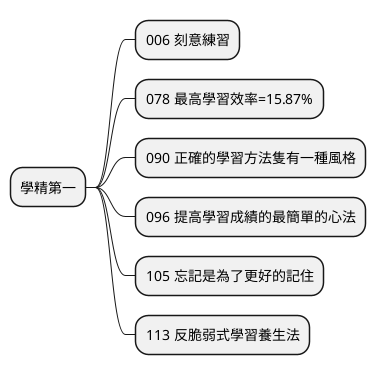
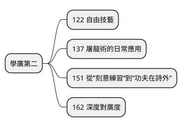
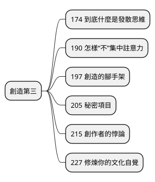
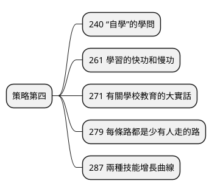
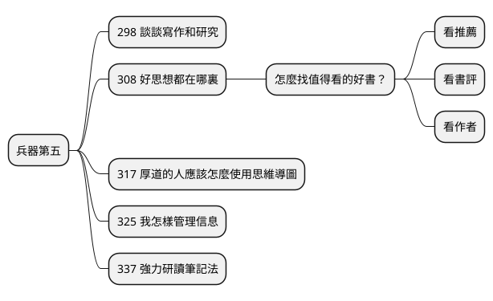
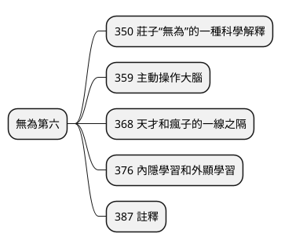

# 學習是什麼

## 參考：高手學習, 萬維鋼

高手學習：「精英日課」人氣作家，教你學精、學廣，煉成別人拿不走的超強自學力
* 作者： 萬維鋼
* 出版社：遠流
* 出版日期：2021/01/27
* 語言：繁體中文
* 定價：380元
* https://www.books.com.tw/products/0010881760

### 書中序言

> 過去幾十年來，科學家們透過實驗研究和對學習高手的觀察，結合心理學特別是腦科學的進步，可以說是發現了學習的祕密。怎樣快速掌握一項標準化的技能？如何加深對知識的記憶？創造性思維到底是什麼？像這樣的問題都已經有了比較清晰的結論。而這些有關學習方法的研究結果都還比較新，有的研究還在進行之中，尚未普及，所以這本書有很多關於學習的新知，是我研究、整理了大量的科學文獻，結合自身的經驗體會，把這些方法總結為六個部分。

> 對於常規性的學習，比如要掌握一項簡單技能或者在某個標準化考試中取得好成績，「刻意練習」這個方法就足夠了，它能讓你學到精通的地步，這是本書第一部分的主題。我大概是第一個把「刻意練習」這個概念介紹給中國讀者的人，甚至本書的第一篇文章你很可能已經讀過。但是這幾年來我看到人們對刻意練習有很多誤解，希望這一次能徹底講明白。

> 並非所有本領都適合刻意練習。我們的第二部分說的是那種能解決複雜問題、能治國安邦的大本領，它需要的不是你對某個技能掌握得特別精，而是要廣泛涉獵多個領域。精和廣是一對矛盾，你需要科學面對。

> 第三部分講創造性。創造性也是可以學的。你需要了解什麼是「發散思維」和「集中思維」，你需要學會連結遙遠的想法，你需要選擇和他人、市場的合適距離，你需要時不時主動放鬆大腦。

> 學習方法是一方面，學習策略則是另一個問題，這也是第四部分的主題。要自學還是跟著老師學？要追求眼前的考試成績還是長遠的能力？選擇什麼樣的技能？學校到底是個幹什麼的地方？我們絕不和稀泥，你會做出明確的選擇。

> 第五部分講講學習和做研究的工具，特別是我喜歡的幾個工具。你會發現「心智圖」是個非常有用的武器，但是一般人根本沒有發揮它的威力。我想告訴你高手是怎麼做事的。

> 不管你學的是什麼領域，最高境界都是「無為」。這是一種令人神往的、隨心所欲而又無所不能的狀態，是一種神祕的體驗。我們在第六部分探索這個只可意會的境界。

# 學精第一

## 006 刻意練習

什麼才叫真正的“刻意練習”？

這個詞你一定聽過很多次了，但想達到真正的“刻意練習”，必須要做到這兩點：
第一，隻在“學習區”練習。比如看書，如果這本書的內容與你原有的觀念不符，而思考之後能夠理解、接受，那它就在學習區內。看不懂或者全知道，都不在學習區。
第二，練習過程中，必須隨時獲得有效反饋。比如彈鋼琴，有老師在一旁告訴你哪裏彈得好、哪裏要改進才有用，自己單獨彈往往冇有進步。

如何達到心流狀態？

做任何事都有“簡單、合適、難”三種狀態，想達到心流，要超過合適，到有一點難、又不太難的狀態。
如果挑戰大大低於你的水準，你會覺得很無聊；如果挑戰大大超出水準，你會感到焦慮；而如果難度隻略微超過一點，你一開始可能有點懵，但調動起全力正好能解決，就容易進入心流體驗。

## 078 最高學習效率=15.87%

## 090 正確的學習方法隻有一種風格

## 096 提高學習成績的最簡單的心法

## 105 忘記是為了更好的記住

 記東西怎麼記得更牢？

除了“記憶麯線”法，還有一種方法：在不同場景下、用不同的方式，學習同一個內容。
同一個知識點，在課堂上看老師演示，這是視覺；回家自己精讀課本，這是讀寫；下一堂課再動手操作一遍，這是實踐。
而且，經常測試是一個很好的提取記憶的手段，也能幫你記得更牢。

## 113 反脆弱式學習養生法

# 學廣第二

## 122 自由技藝

## 137 屠龍術的日常應用

## 151 從‘’刻意練習‘’到“功夫在詩外”

## 162 深度對廣度

# 創造第三

## 174 到底什麼是發散思維

## 190 怎樣“不”集中註意力

## 197 創造的腳手架

## 205 秘密項目

## 215 創作者的悖論

## 227 修煉你的文化自覺

# 策略第四

## 240 “自學”的學問

## 261 學習的快功和慢功

## 271 有關學校教育的大實話

## 279 每條路都是少有人走的路

## 287 兩種技能增長曲線

# 兵器第五

## 298 談談寫作和研究

## 308 好思想都在哪裏

怎麼找值得看的好書？

三個方法：看推薦、看書評、看作者。
看推薦最簡單。像我自己，幾乎所有英文書都在亞馬遜買，它的推薦算法很不錯。專業一點，看主流媒體的書評，比如《紐約書評》《紐約客》《經濟學人》等。
最高級的是跟蹤作者。你要知道在世的、有想法還很能寫的人都有誰，比如納西姆· 塔勒佈、戴維· 佈魯克斯、馬爾科姆·格拉德威爾……他們剛出了什麼書、正在寫什麼，讀多了就會註意到。

## 317 厚道的人應該怎麼使用思維導圖

## 325 我怎樣管理信息

怎樣管理信息？

人腦應該是用來想事的，不是用來記事的。把記事的工作都交給外部工具吧。
我個人選的是Evernote。看到任何有價值的信息，我會第一時間存在Evernote裏，然後進行分類管理。在一條筆記中，還可以插入另一條筆記的鏈接。比如，想寫篇文章解釋現代社會的貧富差距，遇到相關的素材，就把筆記鏈接記下來匯總。
Evernote還能通過算法，自動發現一條筆記的“相關內容”。我們可以把想法寄存在外部工具裏，讓計算機幫你建立連接。

## 337 強力研讀筆記法

做筆記時，用自己的話寫下每一章的邏輯脈絡。每一章的邏輯結構如果真寫出來也許隻有幾句話，可是這幾句話卻常常分佈在好幾十頁之中。你看懂後，不要抄作者的話，要用自己的語言寫出來。
同時，別忘了寫下自己的看法和心得。不論你的觀點和作者是相同還是相反，記下你自己的觀點和評論都很重要。

如何建立自己的知識係統？
你應該為每個學科準備一個筆記本，根據自己的思路劃分章節和專題，用自己的語言整理好自己關註的要點、心得和應用技巧。
最好從學習一開始就有所規劃。比如你要學習物理，就先列出這門學科有哪些要點和問題。再問自己，你想得到什麼？是知道相對論的公式，還是知道它是怎麼被提出的？給自己列一個教學大綱。這能讓你發現係統的漏洞，然後想辦法彌補。

# 無為第六

## 350 莊子“無為”的一種科學解釋

## 359 主動操作大腦

## 368 天才和瘋子的一線之隔

## 376 內隱學習和外顯學習

## 387 註釋

7. 怎樣通過生活小細節，提升創造力？

創造力並不完全等於天賦，可以通過一些生活中的小事來提升它。
你可以找個不需要“費腦子”的事情做，比如織毛衣、擺弄花草、散步之類的重複機械性活動，讓大腦放鬆來到“閒置狀態”。這時，大腦會重新發掘過去的記憶，在過去和未來之間暢想，並把不同的想法連接起來。此時就很容易“靈光一閃”。

8. 怎麼把學會的知識，真正靈活運用？

如果想在碰到真實問題時，立馬找到該用什麼知識應對，那你平時需要混合練習。
美國海軍防空兵就這麼做過：將學員分成兩組，第一組每次隻教一個套路，然後當天隻練它。第二組每天教一個套路，但各種套路混著練。結業大比武中，第二組擊潰了第一組，因為他們知道什麼情況下應該選用什麼套路。
所以你也要一開始就混著練。比如解方程的時候，不能學了一個套路，就隻用它，不然以後碰到複雜的綜合題，不容易臨場判斷用哪個解法。

10. 學習人文學科，關鍵要學什麼？

一開始，我們要學的是“記住事實”。哪年發生了什麼事，哪個皇帝做了什麼。然後，要學習“他人的觀點”，比如對太平天國運動，各位名家都是怎麼評價的。
最重要的，是“學研究方法”。比如想了解一個曆史事件，要考察當時的原始材料，從中得出自己的觀點，並說服別人接受你的觀點。這樣的批判性思維，才是真正值錢的技能。
