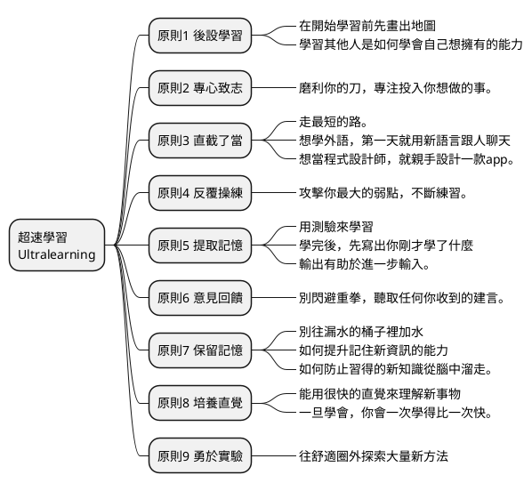

# Ultralearning \(Scott Young\)

```puml
@startmindmap
* 超速學習\nUltralearning
** 原則1 後設學習
***_ 在開始學習前先畫出地圖
***_ 學習其他人是如何學會自己想擁有的能力
** 原則2 專心致志
***_ 磨利你的刀，專注投入你想做的事。
** 原則3 直截了當
***_ 走最短的路。
***_ 想學外語，第一天就用新語言跟人聊天
***_ 想當程式設計師，就親手設計一款app。
** 原則4 反覆操練
***_ 攻擊你最大的弱點，不斷練習。
** 原則5 提取記憶
***_ 用測驗來學習
***_ 學完後，先寫出你剛才學了什麼
***_ 輸出有助於進一步輸入。
** 原則6 意見回饋
***_ 別閃避重拳，聽取任何你收到的建言。
** 原則7 保留記憶
***_ 別往漏水的桶子裡加水
***_ 如何提升記住新資訊的能力
***_ 如何防止習得的新知識從腦中溜走。
** 原則8 培養直覺
***_ 能用很快的直覺來理解新事物
***_ 一旦學會，你會一次學得比一次快。
** 原則9 勇於實驗
***_ 往舒適圈外探索大量新方法
@endmindmap
```

## 閱讀本書的順序

艾爾文推薦，可以從以下三個部份先行閱讀，立即運用在自已的生活或工作。
* 如何提升專注力 -> 第5章
* 針對當前遇到的問題直接學習 -> 第6章
* 學習接受回饋。第9章
  * 回饋有什麼魔力？
  * 什麼是結果型回饋、資訊型回饋、改正型回饋？